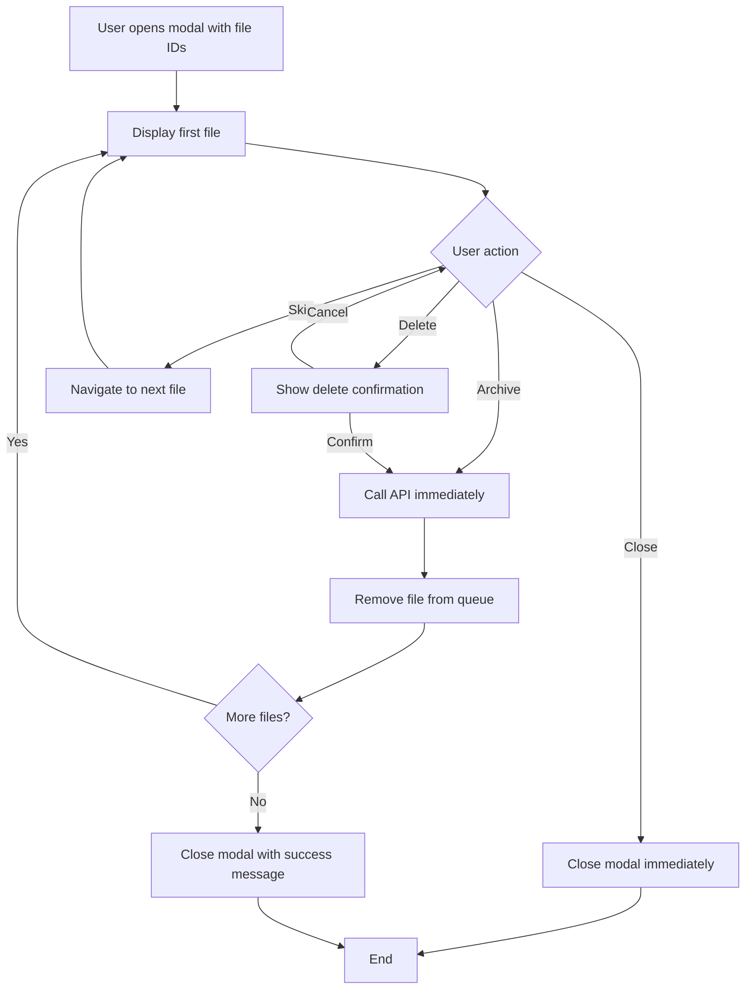
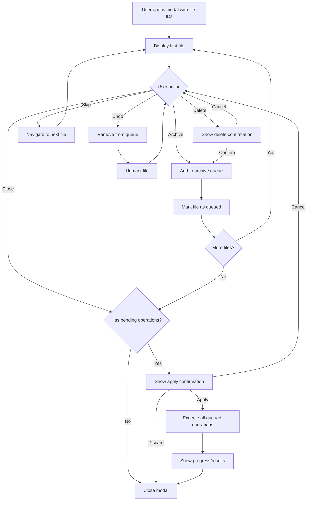
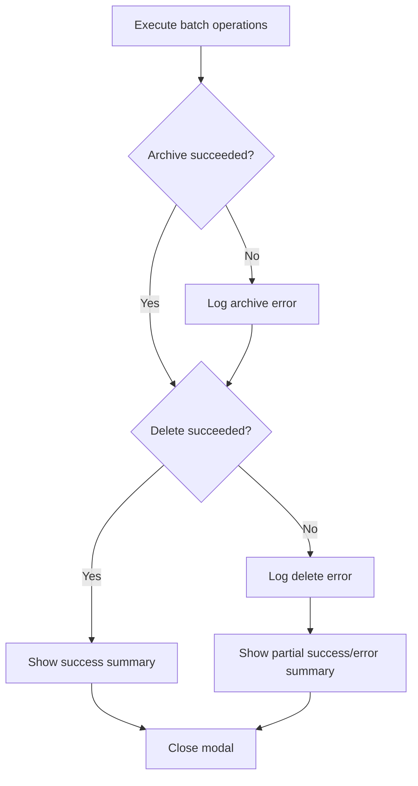

# ArchiveDeleteModal Enhancement Design

## Overview

This document outlines the design for enhancing the `ArchiveDeleteModal` component to queue archive/delete operations and execute them in batch upon user confirmation when closing the modal.

## Current Implementation Analysis

### Component Structure

The [`ArchiveDeleteModal`](../web/hydrui-client/src/components/modals/ArchiveDeleteModal/ArchiveDeleteModal.tsx) component is a modal dialog that allows users to review files and perform archive or delete operations.

### Current Flow



### Key Components and State

1. **Local State in Component**:
   - `showDeleteConfirm`: boolean - Controls delete confirmation dialog visibility
   - `isProcessing`: boolean - Prevents multiple simultaneous operations

2. **PageStore State** ([`ArchiveDeleteMode`](../web/hydrui-client/src/store/pageStore.ts:20)):
   - `active`: boolean - Whether the modal is active
   - `fileIds`: number[] - List of file IDs to process
   - `currentIndex`: number - Current file being displayed

3. **API Calls** (via [`client`](../web/hydrui-client/src/api/client.ts)):
   - [`client.archiveFiles({ file_ids: [currentFileId] })`](../web/hydrui-client/src/api/client.ts:586) - Archives a single file
   - [`client.deleteFiles({ file_ids: [currentFileId] })`](../web/hydrui-client/src/api/client.ts:594) - Deletes a single file

### Current Behavior Issues

1. **Immediate Execution**: Archive and delete operations are executed immediately when the user clicks the button
2. **No Batch Processing**: Each file is processed individually with separate API calls
3. **No Undo**: Once an operation is executed, there is no way to cancel or undo
4. **No Summary**: User does not see a summary of all pending operations before execution

---

## Proposed Design

### New User Flow



### State Management Approach

#### Option 1: Extend PageStore ArchiveDeleteMode

Extend the existing [`ArchiveDeleteMode`](../web/hydrui-client/src/store/pageStore.ts:20) interface to include pending operations:

```typescript
export interface PendingOperation {
  fileId: number;
  operation: "archive" | "delete";
}

export interface ArchiveDeleteMode {
  active: boolean;
  fileIds: number[];
  currentIndex: number;
  pendingOperations: PendingOperation[]; // NEW
}
```

**Pros**:

- State persists across component re-renders
- Consistent with existing architecture
- Easy to access from other components if needed

**Cons**:

- Increases complexity of pageStore
- Persisted state may need cleanup

#### Option 2: Local Component State

Use local React state within the component:

```typescript
interface PendingOperation {
  fileId: number;
  operation: "archive" | "delete";
}

const [pendingOperations, setPendingOperations] = useState<PendingOperation[]>(
  [],
);
```

**Pros**:

- Simpler implementation
- State is automatically cleaned up when modal closes
- No impact on existing store

**Cons**:

- State lost if component unmounts unexpectedly

**Recommendation**: Use **Option 2** (Local Component State) for simplicity and automatic cleanup.

### Data Structures

```typescript
// Type for pending operations
interface PendingOperation {
  fileId: number;
  operation: "archive" | "delete";
}

// Helper to get operation for a file
const getOperationForFile = (
  operations: PendingOperation[],
  fileId: number,
): PendingOperation | undefined => {
  return operations.find((op) => op.fileId === fileId);
};

// Helper to check if file has pending operation
const hasPendingOperation = (
  operations: PendingOperation[],
  fileId: number,
): boolean => {
  return operations.some((op) => op.fileId === fileId);
};
```

### Component Changes

#### New State Variables

```typescript
// Queue of pending operations
const [pendingOperations, setPendingOperations] = useState<PendingOperation[]>(
  [],
);

// Confirmation dialog state
const [showCloseConfirm, setShowCloseConfirm] = useState(false);

// Processing state for batch execution
const [isExecutingBatch, setIsExecutingBatch] = useState(false);
```

#### Modified Handlers

##### handleArchive (Modified)

```typescript
const handleArchive = useCallback(() => {
  if (!currentFileId || isProcessing) return;

  // Add to pending operations instead of executing immediately
  setPendingOperations((prev) => {
    // Remove any existing operation for this file
    const filtered = prev.filter((op) => op.fileId !== currentFileId);
    return [...filtered, { fileId: currentFileId, operation: "archive" }];
  });

  // Navigate to next file or show completion
  navigateToNextOrShowSummary();
}, [currentFileId, isProcessing, pendingOperations]);
```

##### handleDelete (Modified)

```typescript
const handleDelete = useCallback(() => {
  if (!currentFileId || isProcessing) return;

  // Add to pending operations instead of executing immediately
  setPendingOperations((prev) => {
    // Remove any existing operation for this file
    const filtered = prev.filter((op) => op.fileId !== currentFileId);
    return [...filtered, { fileId: currentFileId, operation: "delete" }];
  });

  // Navigate to next file or show completion
  navigateToNextOrShowSummary();
  setShowDeleteConfirm(false);
}, [currentFileId, isProcessing, pendingOperations]);
```

##### handleUndo (New)

```typescript
const handleUndo = useCallback(() => {
  if (!currentFileId) return;

  setPendingOperations((prev) =>
    prev.filter((op) => op.fileId !== currentFileId),
  );
}, [currentFileId]);
```

##### handleClose (Modified)

```typescript
const handleClose = useCallback(() => {
  if (pendingOperations.length > 0) {
    // Show confirmation dialog
    setShowCloseConfirm(true);
  } else {
    // No pending operations, close immediately
    closeArchiveDeleteMode();
  }
}, [pendingOperations.length, closeArchiveDeleteMode]);
```

##### executePendingOperations (New)

```typescript
const executePendingOperations = useCallback(async () => {
  if (pendingOperations.length === 0) return;

  setIsExecutingBatch(true);
  setIsProcessing(true);

  const archiveIds = pendingOperations
    .filter((op) => op.operation === "archive")
    .map((op) => op.fileId);

  const deleteIds = pendingOperations
    .filter((op) => op.operation === "delete")
    .map((op) => op.fileId);

  let successCount = 0;
  let errorCount = 0;

  try {
    // Execute archive operations in batch
    if (archiveIds.length > 0) {
      try {
        await client.archiveFiles({ file_ids: archiveIds });
        successCount += archiveIds.length;
        await refreshFileMetadata(archiveIds);
      } catch (error) {
        errorCount += archiveIds.length;
        toastActions.addToast(
          `Error archiving ${archiveIds.length} files: ${error instanceof Error ? error.message : String(error)}`,
          "error",
        );
      }
    }

    // Execute delete operations in batch
    if (deleteIds.length > 0) {
      try {
        await client.deleteFiles({ file_ids: deleteIds });
        successCount += deleteIds.length;
        await refreshFileMetadata(deleteIds);
      } catch (error) {
        errorCount += deleteIds.length;
        toastActions.addToast(
          `Error deleting ${deleteIds.length} files: ${error instanceof Error ? error.message : String(error)}`,
          "error",
        );
      }
    }

    // Show summary toast
    if (successCount > 0) {
      const summary = [];
      if (archiveIds.length > 0) summary.push(`archived ${archiveIds.length}`);
      if (deleteIds.length > 0) summary.push(`deleted ${deleteIds.length}`);
      toastActions.addToast(`Successfully ${summary.join(" and ")}`, "success");
    }

    // Close modal after execution
    closeArchiveDeleteMode();
  } finally {
    setIsExecutingBatch(false);
    setIsProcessing(false);
    setShowCloseConfirm(false);
  }
}, [
  pendingOperations,
  refreshFileMetadata,
  closeArchiveDeleteMode,
  toastActions,
]);
```

### UI Changes

#### File Status Indicator

Add visual indicator for files with pending operations:

```tsx
// In the action buttons area, show current status
const currentOperation = pendingOperations.find(
  (op) => op.fileId === currentFileId,
);

// Status indicator component
{
  currentOperation && (
    <div className="archive-delete-modal-status">
      <span className={`status-badge status-${currentOperation.operation}`}>
        Pending: {currentOperation.operation}
      </span>
    </div>
  );
}
```

#### Undo Button

Add an undo button when a file has a pending operation:

```tsx
{
  currentOperation && (
    <PushButton
      onClick={handleUndo}
      variant="secondary"
      disabled={isProcessing}
      className="archive-delete-modal-undo-button"
    >
      <ArrowUturnLeftIcon className="archive-delete-modal-button-icon" />
      Undo ({keyboardShortcuts.undo.toUpperCase()})
    </PushButton>
  );
}
```

#### Close Confirmation Dialog

Reuse the existing [`ConfirmModal`](../web/hydrui-client/src/components/modals/ConfirmModal/ConfirmModal.tsx) component:

```tsx
{
  showCloseConfirm && (
    <ConfirmModal
      title="Apply Pending Changes?"
      message={`You have ${pendingOperations.length} pending operation(s):
      ${archiveCount} archive and ${deleteCount} delete.
      Do you want to apply these changes?`}
      confirmLabel="Apply Changes"
      cancelLabel="Discard All"
      onConfirm={executePendingOperations}
      onCancel={() => {
        setPendingOperations([]);
        closeArchiveDeleteMode();
      }}
    />
  );
}
```

#### Progress Indicator

Show pending operation count in header:

```tsx
const progressText = `${archiveDeleteMode.currentIndex + 1} of ${archiveDeleteMode.fileIds.length}`;
const pendingText =
  pendingOperations.length > 0 ? ` (${pendingOperations.length} pending)` : "";

<div className="archive-delete-modal-progress">
  {progressText}
  {pendingText}
</div>;
```

### Keyboard Shortcuts

Add new shortcut for undo operation:

```typescript
const shortcutMap = useMemo(
  () => ({
    Escape: handleClose, // Changed from closeArchiveDeleteMode
    [keyboardShortcuts.archive]: handleArchive,
    [keyboardShortcuts.delete]: () => setShowDeleteConfirm(true),
    [keyboardShortcuts.skip]: handleSkip,
    [keyboardShortcuts.undo]: handleUndo, // NEW
    ArrowLeft: handlePrevious,
    ArrowRight: handleNext,
  }),
  [
    handleClose,
    handleArchive,
    handleSkip,
    handleUndo,
    handlePrevious,
    handleNext,
    keyboardShortcuts,
  ],
);
```

Note: The `undo` shortcut will need to be added to the preferences store.

---

## Error Handling Considerations

### Batch Operation Failures

1. **Partial Success**: If some operations succeed and others fail, show detailed error messages for failures while confirming successes.

2. **Network Errors**: Retry logic could be added for transient network failures.

3. **API Rate Limiting**: Consider adding delays between batch operations if the API has rate limits.

### Error Recovery Flow



### Proposed Error Handling Implementation

```typescript
interface BatchResult {
  operation: "archive" | "delete";
  fileIds: number[];
  success: boolean;
  error?: string;
}

const executePendingOperations = async (): Promise<BatchResult[]> => {
  const results: BatchResult[] = [];

  // ... execute operations and collect results

  return results;
};
```

---

## CSS Changes

Add styles for the new UI elements in [`index.css`](../web/hydrui-client/src/components/modals/ArchiveDeleteModal/index.css):

```css
/* Status indicator */
.archive-delete-modal-status {
  display: flex;
  justify-content: center;
  margin-bottom: 0.5rem;
}

.status-badge {
  padding: 0.25rem 0.75rem;
  border-radius: 9999px;
  font-size: 0.875rem;
  font-weight: 500;
}

.status-archive {
  background-color: var(--color-primary-light);
  color: var(--color-primary-dark);
}

.status-delete {
  background-color: var(--color-danger-light);
  color: var(--color-danger-dark);
}

/* Undo button */
.archive-delete-modal-undo-button {
  /* Similar to other action buttons */
}

/* Pending indicator in progress */
.archive-delete-modal-progress .pending-count {
  color: var(--color-warning);
  font-weight: 500;
}
```

---

## Implementation Checklist

- [ ] Add `PendingOperation` interface and state variables
- [ ] Modify `handleArchive` to queue operations
- [ ] Modify `handleDelete` to queue operations
- [ ] Add `handleUndo` function
- [ ] Modify `handleClose` to show confirmation
- [ ] Add `executePendingOperations` function
- [ ] Add undo button to UI
- [ ] Add status indicator for pending operations
- [ ] Update progress display with pending count
- [ ] Add close confirmation dialog
- [ ] Add CSS styles for new elements
- [ ] Add `undo` keyboard shortcut to preferences
- [ ] Add error handling for batch operations
- [ ] Test all scenarios

---

## Testing Scenarios

1. **Single Archive**: Archive one file and confirm on close
2. **Single Delete**: Delete one file and confirm on close
3. **Multiple Operations**: Archive some, delete others, confirm all
4. **Undo Operations**: Queue operations, undo some, confirm remaining
5. **Discard All**: Queue operations, close and discard
6. **Mixed Navigation**: Queue operation, skip, queue another, go back, undo
7. **Error Handling**: Simulate API failure during batch execution
8. **Keyboard Navigation**: Test all keyboard shortcuts work correctly
