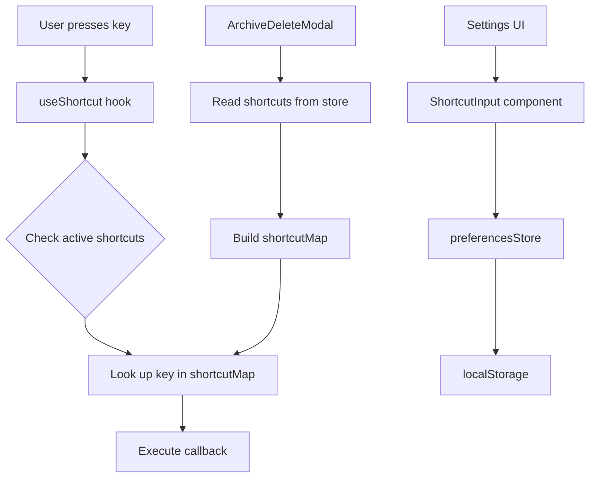
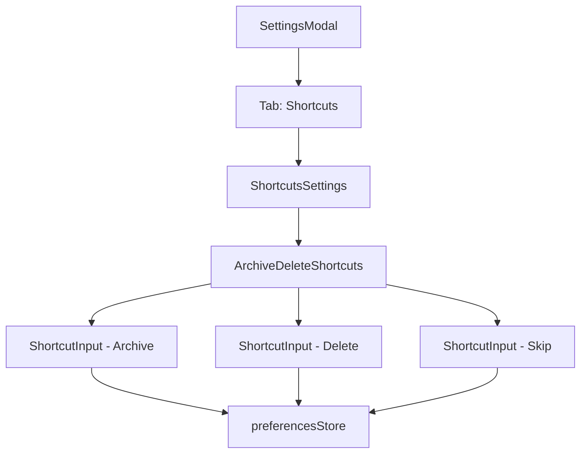
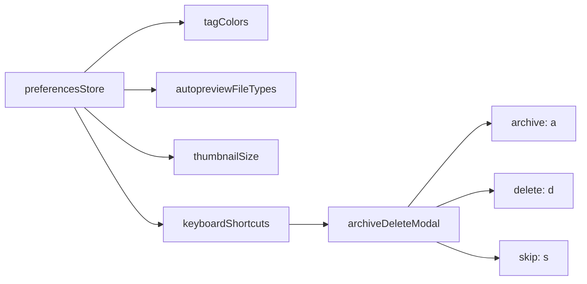

# Keyboard Shortcuts Settings Architecture Design

## Overview

This document outlines the architecture for adding customizable keyboard shortcuts to Hydrui, starting with the Archive/Delete modal's archive, delete, and skip actions.

## Current Implementation Analysis

### ArchiveDeleteModal Keyboard Shortcuts

The [`ArchiveDeleteModal.tsx`](../../src/components/modals/ArchiveDeleteModal/ArchiveDeleteModal.tsx) currently has hardcoded keyboard shortcuts defined at lines 124-131:

```typescript
useShortcut({
  Escape: closeArchiveDeleteMode,
  a: handleArchive,
  d: () => setShowDeleteConfirm(true),
  s: handleSkip,
  ArrowLeft: handlePrevious,
  ArrowRight: handleNext,
});
```

**Current Shortcuts:**
| Action | Key | Description |
|--------|-----|-------------|
| Archive | `a` | Archives the current file |
| Delete | `d` | Shows delete confirmation dialog |
| Skip | `s` | Skips to next/previous file |
| Close | `Escape` | Closes the modal |
| Previous | `ArrowLeft` | Navigate to previous file |
| Next | `ArrowRight` | Navigate to next file |

### useShortcut Hook

The [`useShortcut.ts`](../../src/hooks/useShortcut.ts) hook provides a global keyboard shortcut system:

- Uses a stack-based priority system (`globalShortcuts` array)
- Supports modifier keys in order: `Control+Alt+Shift`
- Automatically ignores shortcuts when focused on input fields
- New shortcuts are prepended (higher priority) to the stack

### Existing Store Patterns

#### preferencesStore.ts

The [`preferencesStore.ts`](../../src/store/preferencesStore.ts) demonstrates the established pattern for persistent settings:

1. **State Management**: Uses Zustand's `create` function
2. **Persistence**: Uses `zustand/middleware`'s `persist` with custom `jsonStorage`
3. **Storage**: Custom storage in [`storage.ts`](../../src/store/storage.ts) that:
   - Uses `localStorage` in normal mode
   - Uses memory storage in demo mode
   - Supports `Set` and `Map` serialization via custom reviver/replacer

4. **Structure Pattern**:
   - State values at top level
   - Actions nested under `actions` object
   - `partialize` function to select what gets persisted
   - `migrate` function for version upgrades

#### Storage Implementation

```typescript
// storage.ts pattern
export const jsonStorage = createJSONStorage(() => storage, {
  reviver: (_key, value) => {
    /* Handle Set/Map */
  },
  replacer: (_key, value) => {
    /* Serialize Set/Map */
  },
});
```

### Settings UI Pattern

The [`SettingsModal.tsx`](../../src/components/modals/SettingsModal/SettingsModal.tsx) uses a tabbed interface:

- Tabs: API, General, Page View, File View, Models
- Each tab renders separate component sections
- Uses `fieldset`/`legend` for grouping settings
- Consistent styling with CSS classes

---

## Proposed Architecture

### 1. Keyboard Shortcuts Store

Create a new store or extend `preferencesStore` to include keyboard shortcuts.

#### Option A: Extend preferencesStore (Recommended)

Add keyboard shortcuts to the existing preferences store for unified management:

```typescript
// In preferencesStore.ts

interface KeyboardShortcutConfig {
  archiveDeleteModal: {
    archive: string; // Default: "a"
    delete: string; // Default: "d"
    skip: string; // Default: "s"
  };
  // Future shortcuts can be added here
}

interface PreferencesState {
  // ... existing fields
  keyboardShortcuts: KeyboardShortcutConfig;
  actions: {
    // ... existing actions
    setKeyboardShortcut: (
      category: string,
      action: string,
      key: string,
    ) => void;
    resetKeyboardShortcuts: () => void;
  };
}
```

**Benefits:**

- Single source of truth for all preferences
- Leverages existing persistence mechanism
- Consistent with existing patterns

#### Option B: Separate shortcutsStore

Create a dedicated store for keyboard shortcuts:

```typescript
// New file: shortcutsStore.ts

interface ShortcutsState {
  shortcuts: KeyboardShortcutConfig;
  actions: {
    setShortcut: (category: string, action: string, key: string) => void;
    resetShortcuts: () => void;
    resetCategory: (category: string) => void;
  };
}
```

**Benefits:**

- Better separation of concerns
- Easier to extend independently
- Can have different persistence settings

### 2. Data Structure

```typescript
// Types for keyboard shortcuts

interface ShortcutDefinition {
  id: string;
  label: string;
  description?: string;
  defaultKey: string;
  category: string;
}

interface KeyboardShortcutConfig {
  archiveDeleteModal: {
    archive: string;
    delete: string;
    skip: string;
  };
  // Future categories:
  // global?: { ... };
  // fileViewer?: { ... };
  // pageView?: { ... };
}

// Default shortcuts
const DEFAULT_KEYBOARD_SHORTCUTS: KeyboardShortcutConfig = {
  archiveDeleteModal: {
    archive: "a",
    delete: "d",
    skip: "s",
  },
};
```

### 3. Persistence Strategy

Shortcuts should be persisted using the same mechanism as other preferences:

- **Storage**: localStorage via `jsonStorage`
- **Key**: `hydrui-preferences` (if extending preferencesStore)
- **Migration**: Include version bump and migration if needed

### 4. UI Component Design

#### Settings Tab Structure

Add a new "Shortcuts" tab to the SettingsModal:

```
┌─────────────────────────────────────────────────────────────┐
│ Settings                                              [X]   │
├─────────────────────────────────────────────────────────────┤
│ [API] [General] [Page View] [File View] [Models] [Shortcuts]│
├─────────────────────────────────────────────────────────────┤
│                                                             │
│ ┌─ Archive/Delete Modal ──────────────────────────────────┐ │
│ │                                                         │ │
│ │  Archive File     [  a  ] [Reset]                       │ │
│ │  Delete File      [  d  ] [Reset]                       │ │
│ │  Skip File        [  s  ] [Reset]                       │ │
│ │                                                         │ │
│ └─────────────────────────────────────────────────────────┘ │
│                                                             │
│                              [Reset All to Default]         │
│                                                             │
└─────────────────────────────────────────────────────────────┘
```

#### Shortcut Input Component

Create a reusable `ShortcutInput` component:

```typescript
interface ShortcutInputProps {
  value: string;
  onChange: (key: string) => void;
  onReset: () => void;
  placeholder?: string;
  disabled?: boolean;
}

// Features:
// - Captures key press and displays the key name
// - Shows modifier keys (Control, Alt, Shift)
// - Validates against conflicts
// - Provides reset button for individual shortcuts
```

### 5. Integration with ArchiveDeleteModal

Modify the ArchiveDeleteModal to consume shortcuts from the store:

```typescript
// ArchiveDeleteModal.tsx

const ArchiveDeleteModal: React.FC = () => {
  const { keyboardShortcuts } = usePreferencesStore();

  // Build shortcut map from config
  const shortcutMap = useMemo(() => ({
    Escape: closeArchiveDeleteMode,
    [keyboardShortcuts.archiveDeleteModal.archive]: handleArchive,
    [keyboardShortcuts.archiveDeleteModal.delete]: () => setShowDeleteConfirm(true),
    [keyboardShortcuts.archiveDeleteModal.skip]: handleSkip,
    ArrowLeft: handlePrevious,
    ArrowRight: handleNext,
  }), [keyboardShortcuts, handleArchive, handleSkip, ...]);

  useShortcut(shortcutMap);

  // Update button labels to show current shortcuts
  // ...
};
```

### 6. Conflict Detection

Implement validation to prevent shortcut conflicts:

```typescript
// In the store or a utility function

function validateShortcut(
  newKey: string,
  category: string,
  action: string,
  allShortcuts: KeyboardShortcutConfig,
): { valid: boolean; conflict?: string } {
  // Check for conflicts within the same context
  // Return conflict info if found
}
```

---

## Implementation Plan

### Phase 1: Core Infrastructure

1. **Add shortcuts to preferencesStore**
   - Add `keyboardShortcuts` state
   - Add `setKeyboardShortcut` action
   - Add `resetKeyboardShortcuts` action
   - Update `partialize` to include shortcuts
   - Bump store version if needed

2. **Create ShortcutInput component**
   - Key capture functionality
   - Display formatting
   - Reset button integration

### Phase 2: UI Implementation

3. **Add Shortcuts tab to SettingsModal**
   - Create `ShortcutsSettings` component
   - Add tab button
   - Wire up to store

4. **Create shortcut category components**
   - `ArchiveDeleteShortcuts` section
   - Future: other categories

### Phase 3: Integration

5. **Update ArchiveDeleteModal**
   - Consume shortcuts from store
   - Update button labels dynamically
   - Handle shortcut changes in real-time

6. **Add conflict detection**
   - Validate on shortcut change
   - Show warning for conflicts

---

## File Structure

```
web/hydrui-client/src/
├── store/
│   └── preferencesStore.ts     # Add keyboard shortcuts state
├── components/
│   ├── modals/
│   │   └── SettingsModal/
│   │       ├── SettingsModal.tsx    # Add Shortcuts tab
│   │       └── index.css
│   └── widgets/
│       └── ShortcutInput/           # New component
│           ├── ShortcutInput.tsx
│           └── index.css
├── hooks/
│   └── useShortcut.ts          # No changes needed
└── types/
    └── shortcuts.ts            # New: Type definitions
```

---

## Considerations

### Accessibility

- Shortcuts should be displayed in button labels and tooltips
- Consider screen reader announcements when shortcuts change
- Ensure keyboard navigation in the settings UI

### Internationalization

- Key names should be localized where applicable
- Consider different keyboard layouts (QWERTY vs AZERTY, etc.)

### Future Extensibility

- Design allows adding new shortcut categories
- Category-based organization supports scoped shortcuts
- Store structure supports migration for future changes

### Edge Cases

- What happens if a user sets an empty shortcut?
- How to handle reserved keys (Escape, Enter, etc.)?
- Should modifier-only shortcuts be allowed?

---

## Mermaid Diagrams

### Data Flow



### Component Hierarchy



### Store State Structure



---

## Summary

This design proposes extending the existing `preferencesStore` with a `keyboardShortcuts` section, following established patterns for state management and persistence. The UI will add a new "Shortcuts" tab to the SettingsModal with a reusable `ShortcutInput` component. The `ArchiveDeleteModal` will be updated to consume shortcuts from the store, enabling real-time customization without code changes.
